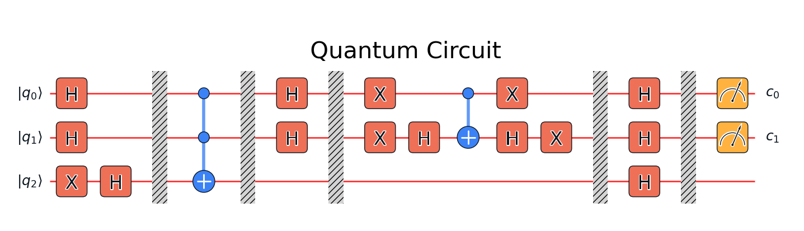
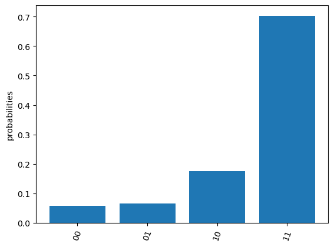

## 综述：Grover搜索算法在质因数分解中的应用
质因数分解是密码学中的基础问题，尤其在RSA加密算法中具有重要意义。传统的经典算法在大数分解时存在显著的时间复杂度瓶颈，因此量子计算的引入为该问题提供了潜在的解决方案。Shor算法被认为是质因数分解问题的突破性量子算法。

Grover搜索算法作为量子计算中的另一重要算法，通过加速无结构搜索问题在理论上对质因数分解提供了一定的加速。Shor算法前人之述备矣，所以作为结课报告，质因数分解问题可以作为Gorver搜索算法的应用实验。
  
以下介绍课程中学到的三种算法，并设计实验，对前两种算法进行代码实现。
### 经典算法：辗转相除法
辗转相除法是一种遍历搜索算法：从2开始试除，如果 $N \mod 2 = 0$，就将其除以2，并持续除以2，直到结果不能再被2整除为止。对于每次除法，将2记录为一个因数。直到 $N$ 不再能被2整除。
遍历质数表,对于每一个质数 $p_i$ ,重复上述操作，直至 $p_n=[\sqrt N]$  

#### 代码实现
```python
import time

def prime_factors(n):
    factors = []
    
    # Step 1
    while n % 2 == 0:
        factors.append(2)
        n //= 2
    
    # Step 2
    factor = 3
    while factor * factor <= n:
        while n % factor == 0:
            factors.append(factor)
            n //= factor
        factor += 2
    
    # Step 3
    if n > 2:
        factors.append(n)
    
    return factors

# 输入N
number = 120111010111000100111001

# Start measuring time
start_time = time.time()

# Get the prime factors
factors = prime_factors(number)

# End measuring time
end_time = time.time()

# Print the result
print(f"Prime factors of {number} are: {factors}") 

# Print the execution time
print(f"Execution time: {end_time - start_time:.6f} seconds")
```

#### 实验结果分析：
```
Prime factors of 120111010111000100111001 are: [3, 1297403, 30859342371131689]
Execution time: 8.839725 seconds

Prime factors of 12011101011100010011100101 are: [19, 5277607, 119782168530268897]
Execution time: 17.376526 seconds
```

调用time函数记录运行时间，运行代码。发现在$10^{27}$的数量级内，经典算法能很好地运行（8s）；但当$N$的数量级高于$10^{29}$时，运行时间开始随数量级迅速增加（17s）。质因数分解的经典算法时间复杂度为$O(\sqrt{N})$,对于$N$ 较大的情形，经典算法计算成本高。

### Grover搜索
Grover搜索算法要解决的其实并不是质因数分解问题,而是搜索问题：
如果有$N$条备择元素:
$$[N]=\{|0\rangle ,\,|1\rangle,\,\ldots,\,|g\rangle,\ldots,\,\,|N-1\rangle\}$$
定义函数$f(x\rangle)$
$$
f(|x\rangle)=\begin{cases}
1，x=g\\
0，else
\end{cases}
\quad \text{where} \,|x\rangle\in[N]
$$
在经典计算机上至少需要$O(N)$次操作来确定目标元素$|g\rangle$,而Grover算法仅通过$O(\sqrt N)$次操作就可以确定之。
定义对$|g\rangle$的Householder变换算符（N个正交归一态矢中，只针对$|g\rangle$做“镜面反射”变换）
$$\mathbf R_g=\mathbf I-2|g\rangle\langle g|$$
其满足：$$\begin{cases}
\mathbf R_g |g\rangle=-|g\rangle\\
\mathbf R_g |g_{\perp}=|g_{\perp}\rangle
\end{cases}$$
先考虑单次Grover搜索，制备一个初态：
$$
\begin{equation}\begin{aligned}
|\psi\rangle&=\mathbf H^{\otimes n}|0\rangle^{\otimes n }\\
&=\frac{1}{\sqrt N}\sum_{x=0}^{N-1}|x\rangle
\end{aligned}\end{equation}
$$
执行对$|0\rangle$的负Householder变换：
$$|x\rangle\to-(-1)^{\delta_{x0}}|x\rangle$$
再做Hadmard变换，得到末态。基于此三个步骤，可以构建Grover迭代算符$G$：
$$\begin{equation}\begin{aligned}
\mathbf G&=\mathbf H^{\otimes n}(-\mathbf R_0) H^{\otimes n}\\
&=-\mathbf H^{\otimes n}(\mathbf I-2|0\rangle\langle 0|)\mathbf H^{\otimes n}\\
&= -\mathbf I+2\mathbf H^{\otimes n}|0\rangle\langle 0|\mathbf H^{\otimes n}\\
&=2|\psi\rangle\langle \psi|-\mathbf I
\end{aligned}\end{equation}$$
容易证明$\mathbf G$作用在任意的态$\sum_k\alpha_k|k\rangle$上产生：
$$\mathbf G\sum_k\alpha_k|k\rangle=\sum_k[-\alpha_k+2\langle\alpha\rangle]|k\rangle$$
可以由上式看出，变换后的各个态的概率幅与原先的关系是一种关于均值线的对称变换。
Grover算法即为对一个一般的初始态$|\psi\rangle$做k次Grover迭代。如果把$|\psi\rangle$记作目标态$|g\rangle$（good）和垃圾态$|b\rangle$（bad）的线性组合
$$|\psi\rangle=\sqrt{\frac{N-M}{N}}|b\rangle+\sqrt{\frac{M}{N}}|g\rangle$$
其中$|g\rangle,|b\rangle$满足
$$|b\rangle=\sum_i^{N-M}|b_i\rangle,\quad|g\rangle=\sum_j^{M}|g_j\rangle,\,\text{where}|b_i\rangle 、|g_j\rangle\in[N]$$
令$$\cos\frac\theta2=\sqrt{\frac{N-M}{N}}$$
那么一次Grover迭代相当于一次在以$|b\rangle\,|g\rangle$为基矢的线性空间的旋转操作：
$$
\mathbf G |\psi\rangle = \cos{ \frac{3\theta}{2}}|b\rangle + \sin{\frac{3\theta}{2}} |g\rangle
$$
所以k次操作亦相当于k次旋转：
$$
\mathbf G^k |\psi\rangle = \cos{ \frac{(2k+1)\theta}{2}}|b\rangle + \sin{\frac{(2k+1)\theta}{2}} |g\rangle
$$
当k满足$k\approx\frac12(\frac{2\pi}{\theta}-1)=O(\sqrt N)$时，$|g\rangle$的振幅趋近于1，这时我们就找到了目标态。 
接下来回到质因数分解问题，事实上Grover搜索只不过是在加速经典算法中挨个试除的过程。经过平方加速，只需要$O(N^{\frac14})$次试除。

#### 代码实现
利用Quafu云计算平台，可以高效实现量子线路搭建与计算：
```python
#初始化
pip install pyquafu
import matplotlib.pyplot as plt
%matplotlib inline
import numpy as np
#登陆云计算平台
from quafu import User
user = User("个人密钥")
user.save_apitoken()

# 导入工具包
from quafu import QuantumCircuit, simulate, Task
# 定义householder算符（相位反转）
def phase_shift(q):
    for i in range(2):
        q.x(i)
    q.h(1)
    q.cnot(0,1)
    q.h(1)
    for i in range(2):
        q.x(i)
    return q
# 搭建量子线路
qc = QuantumCircuit(3)
qc.x(2) # 第三个量子比特储存有黑箱f（g）的目标态｜1>
for i in range(3):  # 制备初态
    qc.h(i)# hadmard变换
qc.barrier([0,1,2])#分割线
qc.mcx([0,1],2) # 应用检验函数f（x），此处是toffoli门
qc.barrier([0,1,2])
for i in range(2):
    qc.h(i)
qc.barrier([0,1,2])
phase_shift(qc) # 相位反转
qc.barrier([0,1,2])
for i in range(3):
    qc.h(i)
qc.barrier([0,1,2])
qc.measure([0,1])#测量第一个和第二个量子比特
```

```python
#绘制量子线路
qc.plot_circuit(title=' Quantum Circuit')
```

```python
task = Task()  # 创建后方任务
task.config(backend="Baihua", shots=5000, compile=True) # backend参数用来确定量子计算机，可用的计算机列表可通过“available_backends = user.get_available_backends()”指令得到
res = task.send(qc,name="Grover_algorithm")#返回测量结果
res.plot_probabilities()#绘制概率幅
```


返回值告诉我们，振幅最高的态$|1，1\rangle=|3\rangle$即为所求。
### Shor算法 
Shor算法通过将整数分解问题转化为一个寻找某个函数的周期的问题，所以我们需要找到“某个函数$f(n)$”和它的周期$r$。

构造函数
$$
f(n)=a^n(\mod N)
$$
其中$a$满足$\gcd(a,N)=1$。

引理1：a的阶r即为$f(n)$的周期。
证明：
$$
\begin{equation}\begin{aligned}
f(n+r)&=a^{n+r}(\mod N)\\
&=[a^n \mod N\times a^r\mod N](\mod N)\\
&=(a^n \mod N\times 1)\mod N\\
&=a^n \mod N\mod N\\
&=a^n \mod N\\
&=f(n)
\end{aligned}\end{equation}
$$
证毕。
引理2:$r$ 与$N$ 的质因子的关系：$a^{r/2}\pm 1$和$N$的最大公约数必定含有N的因子

基于此，建立量子算法：（制备初态将 $q$ 选择为$2$的幂是为了QFT的方便）。
给定待分解整数 $N$，选择 $q = 2^k$ 满足 $N^2 \leq q \leq 2N^2$。（即$k\approx \log_2 N$，将 $q$ 选择为$2$的幂是为了QFT的方便）接下来，随机选择一个 $a < N$，并用$|\psi_0\rangle$态初始化两个长度为$k+1$量子比特的寄存器。
其中
$$|\psi_0\rangle=|0\rangle^{\otimes k}\otimes |0\rangle$$
对第一个寄存器中的态矢作Hadmard变换:
$$

|\psi_1\rangle=(\mathbf H^{\otimes k}\otimes \mathbf I)|\psi_0\rangle=\frac{1}{\sqrt{q}} \sum_{n=0}^{q-1} |n\rangle|0\rangle

$$
计算 $a^n \mod N$，并将结果存储到第二个辅助寄存器中，得到：
$$
\begin{equation}\begin{aligned}
|\psi_2\rangle&=\mathbf U_f|\psi_1\rangle\\

&=\frac{1}{\sqrt{q}} \sum_{n=0}^{q-1} |n\rangle |a^n \mod N\rangle\\

&=\frac{1}{\sqrt{q}} \sum_{n=0}^{q-1} |n\rangle |f(n)\rangle\\

\end{aligned}\end{equation}
$$
测量第二存储器：假设结果为 $f_0$，其中 $f_0 = a^n_0 \mod N$ 对某个最小的 $n_0$ 成立。如果 $r$ 是 $a \mod N$ 的阶，那么 $f_0=a^n = a^{n_0 + jr} \mod N$ 对所有 $j=0,1,2\dots D-1$ 成立（周期性）。其中$D\in \mathbb Z,D\ge \frac{2^k-n_0}{r}$（因为n的上限是$2^m-1$。因此，测量将在第一个寄存器中选择满足 $n = n_0, n_0 + r,  \ldots, n_0 + Dr$ 的值。
所以$$D=[\frac{2^k-n_0}{r}]$$第一个寄存器的测量后坍缩为：
$$
\begin{equation}\begin{aligned}
|\psi_3\rangle &= \frac{1}{\sqrt{D}} \sum_{j=0}^{D-1} |n_0 + jr\rangle\\
&=\frac{1}{\sqrt{D}} \sum_{n=0}^{q-1} g(n)|n\rangle
\end{aligned}\end{equation}
$$
其中
$$
g(n)=
\begin{cases}
1，n=n_0+jr\\
0，\text{else}
\end{cases}
$$
因此，我们获得了一个标签基态的均匀叠加，其中的标签以周期 $r$ 被选定。从这个状态中，我们希望提取$g(n)$的周期 $r$ 的信息，且提取概率不会随着 $N$ 的增大而迅速下降。更确切地说，如果上述计算重复最多 $\text{poly}(\log N)$ 次，我们希望以常数概率提取 $r$ 的值。注意，重复操作时（$a$ 固定），$n_0$ 的值（因此 $|\psi\rangle$ 的最终状态）会变化，但 $r$ 保持不变。

为了达成上述目的，对第一寄存器中储存的$|\psi_3\rangle$作量子傅里叶变换
$$
\mathbf U_{QFT} |n\rangle = \frac{1}{\sqrt{2^k}}\sum_{y=0}^{2^k-1}e^{i\frac{2\pi}{2^k}ny}|y\rangle
$$
于是
$$

\begin{equation}\begin{aligned}
|\psi_4\rangle&=\mathbf U_{QFT} |\psi_3\rangle\\

&=\mathbf U_{QFT}\frac{1}{\sqrt{D}} \sum_{n=0}^{q-1} g(n)|n\rangle\\

&=\frac{1}{\sqrt{D}} \sum_{n=0}^{q-1} g(n)(\frac{1}{\sqrt{q}}\sum_{y=0}^{q-1}e^{i\frac{2\pi}{q}ny}|y\rangle)\\

&=\frac{1}{\sqrt{D}}\sum_{y=0}^{q-1}[\frac{1}{\sqrt{q}}\sum_{n=0}^{q-1}g(n)e^{i\frac{2\pi}{q}ny}]\,|y\rangle\\

&=\frac{1}{\sqrt{D}}\sum_{y=0}^{q-1}G(y;x)\,|y\rangle
\end{aligned}\end{equation}

$$
$G(y;x)$中，$x$已经被求和消掉，所以$G(y;x)=G(y)$，即为$|y\rangle$对应的振幅（量子傅里叶变换的意义所在）
若$y$在$\frac{q}{r}$的整数倍附近，则$|G(y)|$很大。为了简便，只考虑 $r$ 可以整除 $q$ 的情况：
$$
\begin{equation}\begin{aligned}
G(y)&= \frac{1}{\sqrt{q}}\sum_{n=0}^{q-1}g(n)e^{i\frac{2\pi}{q}ny}\\

&=\frac{1}{\sqrt{q}}\sum_{j=0}^{D-1}e^{i\frac{2\pi}{q}(n_0+jr)y}\\

&=\frac{1}{\sqrt{q}}e^{i\frac{2\pi}{q}n_0y}\sum_{j=0}^{D-1}e^{i\frac{2\pi}{q}(jr)y}\\

&=\frac{1}{\sqrt{q}}e^{i\frac{2\pi}{q}n_0y}\sum_{j=0}^{D-1}e^{i\frac{2\pi}{D}jy}
\end{aligned}\end{equation}
$$

令$y=\lambda q / r$，其中 $\lambda = 0, \ldots, r - 1$ （$\lambda$的每个取值的概率均等）。同时初始偏移 $n_0$ 带来的相因子可以提出求和符号，所以不会影响 $q / r$。
因此，傅里叶变换将输入的周期性 $r$ 反转为 $q / r$，并且具有消除偏移 $n_0$ 的平移不变性。
之后，我们测量振幅 $y$，有 $y / q = \lambda / r$。这里 $y$ 和 $q$ 是已知的。如果 $\text{gcd}(\lambda, r) = 1$，则可以通过将 $y / q$ 简化为不可约分数来确定 $r$。由于 $\lambda$ 是随机选择的， $\text{gcd}(l, r) = 1$ 的概率大于 $1 / \log r$（对于较大的 $r$）。因此，如果我们重复计算 $O(\log r) < O(\log N)$ 次，可以将成功概率提高到接近 1。此即高效确定 $r$ 的方法。

## 总结与展望
随着量子计算技术的不断发展，Grover算法在质因数分解中的潜力逐渐被发掘。尽管Shor算法在理论上具有明显的优势，但由于当前量子硬件的限制，Grover算法仍然是一种具有实际应用前景的选择。本文通过基于Quafu平台的量子电路设计，初步展示了Grover算法在质因数分解中的应用，并为未来量子算法的研究提供了新的方向。
随着量子计算技术的进一步成熟，未来可能会有更多的量子算法被提出，并应用于质因数分解等密码学领域。量子计算在破解现代加密系统方面的潜力仍有待深入探索，随着量子硬件的不断发展，质因数分解和其他计算任务的量子加速将会带来革命性的影响。

**参考文献**

1. 向华. 《量子数值代数》.清华大学出版社

2. Nielsen, M. A., & Chuang, I. L. (2000). _Quantum Computation and Quantum Information_. Cambridge University Press.

3. 李士勇, & 李盼池. (2009). 《量子计算与量子优化算法》.哈尔滨工业大学出版社

4. Cao, Z. (2005). A note on Shor’s quantum algorithm for prime factorization.

5. Whitlock, S., & Kieu, T. D. (2023). Quantum factoring algorithm using Grover search.


